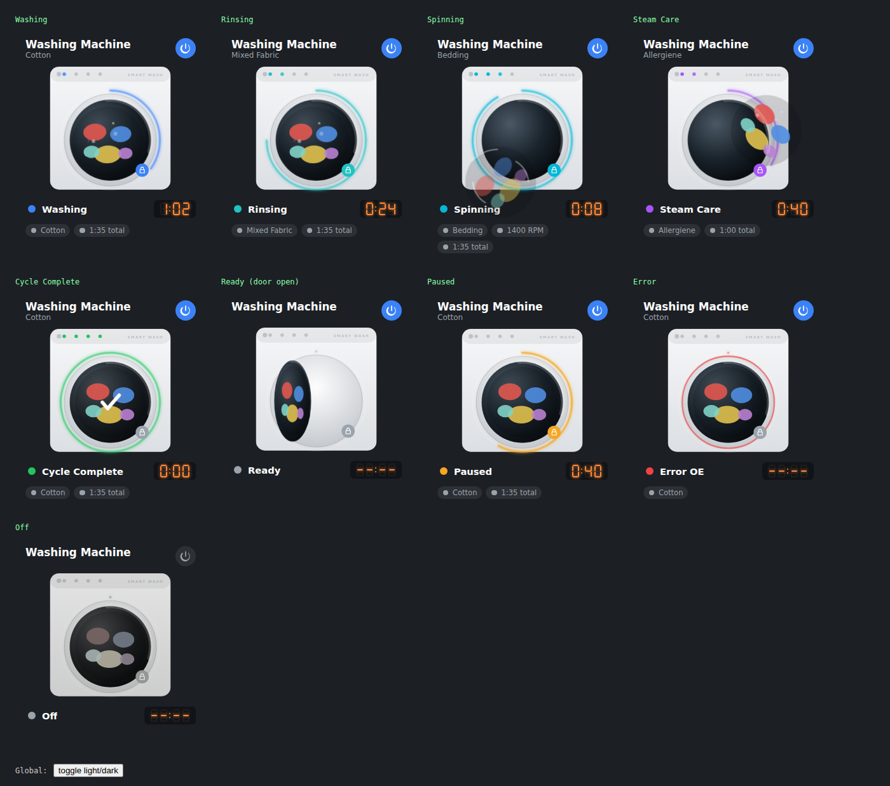

# LG Washer Card

A realistic, animated Lovelace card for an LG (ThinQ) washing machine — a real front-loader illustration with a tumbling drum, suds, a porthole progress ring, a 7-segment digital countdown, phase-indicator lights, and a door-lock badge, all driven live off your Home Assistant entities.



Every raw status your integration reports (`washing`, `RINSING`, `Spin-Complete`, whatever casing/format it uses) is normalised, so it degrades gracefully even on states the card doesn't explicitly know about.

## Install

### HACS (custom repository)

1. HACS → Frontend → ⋮ → Custom repositories → add this repo as type **Dashboard**.
2. Install "LG Washer Card".
3. Add resource (HACS does this automatically) or manually:
   ```yaml
   resources:
     - url: /hacsfiles/lg-washer-card/lg-washer-card.js
       type: module
   ```

### Manual

1. Copy `lg-washer-card.js` into `<config>/www/lg-washer-card/`.
2. Add the resource in Settings → Dashboards → ⋮ → Resources:
   ```yaml
   url: /local/lg-washer-card/lg-washer-card.js
   type: module
   ```

## Configuration

Add the card via the GUI editor ("LG Washer Card" in the card picker) or YAML. Only `status_entity` is required — everything else is optional and the card hides what you don't configure.

```yaml
type: custom:lg-washer-card
name: Washing Machine
status_entity: sensor.washer_current_status
remaining_time_entity: sensor.washer_remaining_time
total_time_entity: sensor.washer_total_time
course_entity: sensor.washer_course
temperature_entity: sensor.washer_temperature
spin_speed_entity: sensor.washer_spin_speed
door_lock_entity: binary_sensor.washer_door_lock
door_open_entity: binary_sensor.washer_door_open
child_lock_entity: binary_sensor.washer_child_lock
error_entity: sensor.washer_error
power_entity: switch.washer_power
show_progress_ring: true
show_phase_lights: true
```

| Option | Required | Description |
|---|---|---|
| `status_entity` | ✅ | The sensor reporting the machine's run state (drives everything: animation, colour, phase lights, label). |
| `name` | | Card title. Default `Washing Machine`. |
| `remaining_time_entity` | | Minutes remaining, `H:MM`, or an ISO timestamp of estimated completion. |
| `total_time_entity` | | Total cycle length — used with remaining time to drive the progress ring if `progress_entity` isn't set. |
| `progress_entity` | | A 0–100 sensor to drive the ring directly instead of deriving it from time. |
| `course_entity` | | Program/cycle name, shown under the title and as a chip. |
| `temperature_entity` / `spin_speed_entity` | | Shown as chips when present. |
| `door_lock_entity` | | `binary_sensor` — `on` = locked. Shows the lock badge on the door. |
| `door_open_entity` | | `binary_sensor` — `on` = door ajar. Swings the door open in the illustration. |
| `child_lock_entity` | | `binary_sensor` — `on` shows a "LC" child-lock readout and a chip. |
| `error_entity` | | Sensor holding an error code (e.g. `OE`, `IE`). Overrides the status label/icon and pulses the bezel red. |
| `power_entity` | | A `switch` — adds a header power toggle. |
| `show_progress_ring` | | Default `true`. |
| `show_phase_lights` | | Default `true`. Wash → Rinse → Spin → Done indicator lights on the fascia. |

### Entity naming by integration

- **Official "LG ThinQ" integration**: entities are generally named `sensor.<device>_current_status`, `sensor.<device>_remaining_time`, `sensor.<device>_total_time`, `select.<device>_operation` (course), `switch.<device>_power`. Check **Developer Tools → States** for your device's exact entity IDs — LG's ThinQ API varies what it reports per model — and map them in the config above.
- **`ha-smartthinq-sensors` (HACS)**: exposes a single sensor with a large attributes dict; point `status_entity` at it and create small template sensors for `remaining_time`, `door_lock`, etc. if you want them broken out, or extend the card's `_getState` lookups to read attributes directly.
- **Anything else / template sensors**: the card doesn't care where the state comes from — any entity reporting one of the recognised state words (see `STATE_MAP` in `lg-washer-card.js`) will drive the right animation and colour, and unrecognised states still display (title-cased) with a sensible default look.

## Recognised states

`off`, `standby`/`initial`/`reserve`, `detecting`, `presoak`/`soaking`, `wash`/`washing`, `rinse`/`rinsing`, `steam`/`sterilizing`/`allergiene`, `spin`/`spinning`, `dry`/`drying`, `cooling`/`cool_down`, `wrinkle_care`, `end`/`complete`/`finish`, `pause`/`paused`, `error`/`err`, `delay`/`reservation`. Matching is case-insensitive and ignores punctuation, so `Washing`, `WASHING`, and `washing-in-progress`-style values all resolve sensibly (the last one falls back to a generic "running" look).

## Notes

- No external dependencies (fonts, icon packs, build step) — a single vanilla JS custom element with an inline SVG illustration and a hand-drawn CSS 7-segment display, matching the rest of the `ar_smart_*` card family.
- `preview.html` in this repo is a standalone mock (no Home Assistant needed) that renders every state side by side — open it directly in a browser to check colours/animations after editing the card.
